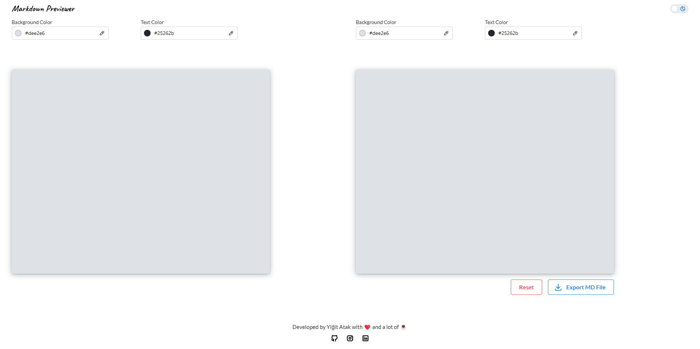
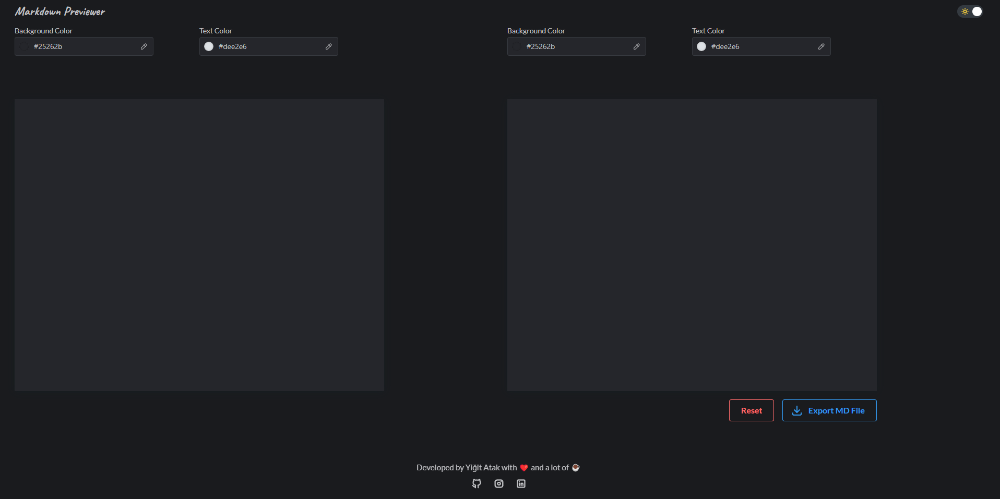

## Markdown Previewer v2 by Yiğit Atak

> Preview of your Markdown. Fast, easy and customizable.

[Live demo](https://amazing-semifreddo-6e9e1e.netlify.app/)

### Table of Contents
- [About the project](#about)
- [Features](#features)
- [Built with](#built-with)
- [Getting started](#getting-started)
- [Installation](#installation)
- [Usage](#installation)
- [Roadmap](#roadmap)
- [Contributing](#contributing)
- [License](#license)
- [Contact](#contact)

### About
This is the second version of my markdown previewer. The code has been **completely** over-hauled as I wrote this one from scratch. Just like the previous one, customization has been at the forefront of my development process. As such, I took the pre-defined theming to the next level and gave the end-user the freedom to choose whichever color they want for both the background and the text. Furthermore, the new version introduces Dark Mode. For a full list of features, please check [Features](#features) Suggestions for further improvement are welcome. Check the to-do list down below for my current road map for this project.

### Features
- Fully customizable colors for both input and output(new in v2)
- Light/Dark Mode(new in v2)
- Export straight from the app(new in v2)
- Utilizes TypeScript instead of JavaScript! (new in v2)
- See the preview of the markdown you're typing out
- Reset the markdown with a single button click

### Built with
This project uses multiple libraries and frameworks. All the libraries and frameworks are subject to change as development continues.
- [React](https://react.dev/)
- [Markdown-It](https://github.com/markdown-it/markdown-it)
- [vite](https://vitejs.dev/)
- [Mantine](https://mantine.dev/)
- [tabler icons](https://tabler-icons.io/)

### Getting Started
You need the following tools for installation:
- [NPM](https://www.npmjs.com/)

#### Installation
1. Clone the repo.
`https://github.com/Arintia/markdown-previewer-v2`
2. Navigate to the newly created folder.
`cd markdown-previewer-v2`
3. Install all the dependencies.
`npm i`
4. Boot it up.
`npm run dev`
5. Happy coding!

### Usage
This project can be used for when you're writing out a markdown file for your own project. 

### Roadmap
- [ ] Usage of cookies/localStorage to store state
- [ ] Better responsiveness. There's currently none but it isn't horrible.

### Contributing
Contributions are what make the open source community such an amazing place to learn, inspire, and create. Any contributions you make are **greatly appreciated**.

If you found a bug or if you have a suggestion, feel free to fork this repo and create a pull request. Also feel free to open an issue and I'll get to it when I have time! If you want to work on an enhancement on your own, here's how you can achieve that:

1. Fork the project
2. Create a branch (`git checkout -b feature/SomeNewFeature`)
3. Commit your changes after you're done (`git commit -m "Add Some New Feature"`)
4. Push your commit (`git push origin feature/SomeNewFeature`)
5. Open a pull request
6. Wait for me to review it and merge it or suggest changes!

### License
This project is distributed under the [MIT](https://choosealicense.com/licenses/mit/) license. 

### Contact
You can connect with me on [LinkedIn](https://www.linkedin.com/in/yigitatak/)